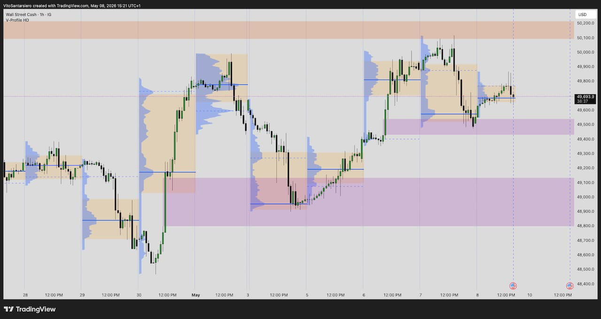
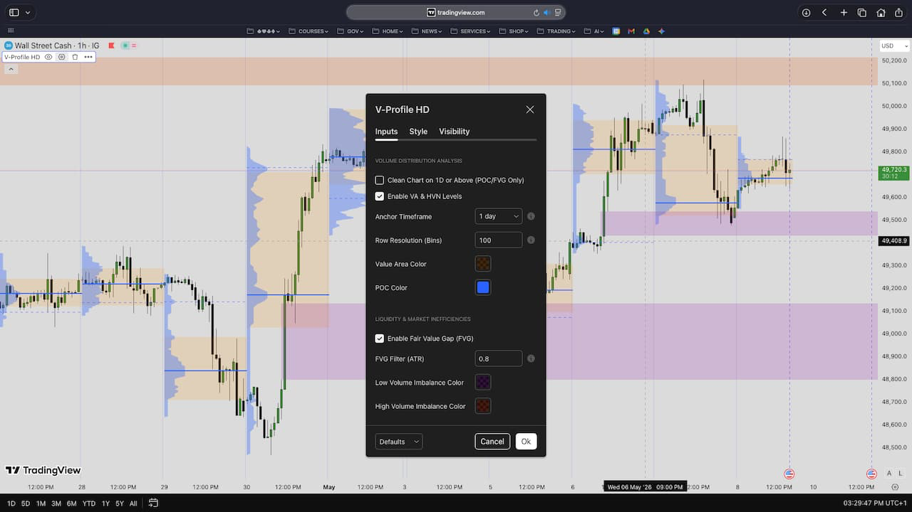

# V-Profile Matrix — Volume Profile with Power Score Engine

**Pine Script v6 | TradingView | Public Release 2026 — Protected Source Code**

Advanced volume-profile analysis engine combining configurable anchor periods, POC, LVN/HVN and Value Area analysis with ATR-filtered Fair Value Gap detection. Includes liquidity-gap classification, historical profile tracking and LVN mitigation monitoring.

Built and used daily in live trading. Part of the V-Suite — works best combined with the [V-Sessions Engine](https://github.com/VTS92/V-Sessions-Engine) and the [V-WAPE Engine](https://github.com/VTS92/V-WAPE-Engine).

---

## What it does

V-Profile Matrix maps where volume concentrates across price levels, then quantifies the strength of every detected price imbalance with a numeric Power Score. It answers two questions: **where were institutions active — and which imbalances are most likely to drive the next move?**

The indicator combines four analytical layers:

**Volume Distribution Analysis**
- **POC (Point of Control)** — the price level with the highest traded volume. Price tends to return here repeatedly.
- **Value Area** — the price range containing 70% of all volume. Defines the market's accepted fair value zone.
- **HVN (High Volume Nodes)** — areas of heavy institutional activity. Act as strong support and resistance.
- **LVN (Low Volume Nodes)** — price gaps with little trading activity. Price moves through these rapidly.

**Fair Value Gap (FVG) Detection with Power Score**
- Bullish and bearish FVGs filtered by an ATR-based volatility threshold to eliminate noise
- Each FVG is classified by liquidity context (Support / Resistance / Vacuum) and by the volume density at the gap level (LVN / HVN)
- **Power Score (1–5)** — a composite metric combining volume-vacuum intensity, local volume gradient and gap size relative to ATR, surfaced as a structured label (e.g. `VAC-L5`)

**Historical Tracking & Mitigation Monitoring**
- Optional historical display of past volume profiles and Value Areas per anchor period
- LVN mitigation tracking — monitors when price revisits and fills a previously identified low-liquidity zone

**Adaptive Rendering**
- Profile elements automatically hide when the chart timeframe meets or exceeds the configured anchor timeframe, keeping higher-timeframe charts clean while preserving POC and FVG visibility

---

## Screenshots

---

## Access

This repository documents the design and functionality of V-Profile Matrix as part of a professional portfolio. The source code is **not distributed in this repository** — the script is published and maintained as a protected (closed-source) invite-only script on TradingView.

For access or a walkthrough of the implementation, please get in touch via [LinkedIn](https://linkedin.com/in/vito-santarsiero).

---

## Configuration Overview

| Parameter | Default | Description |
|---|---|---|
| Anchor Timeframe | 1 Day | Historical window for volume calculation |
| Row Size | 24 | Vertical price granularity (bins) |
| LVN Mode | Enable | Highlights Low Volume Nodes from the session profile |
| FVG Selector Mode | High Edge | Controls which Fair Value Gaps are displayed and scored |
| ATR Multiplier | 0.6 | Minimum gap size relative to volatility |
| Historical Data Display | None | Shows historical profiles or mitigated LVNs |

---

## Part of the V-Suite

V-Profile Matrix works best when combined with the rest of the suite:

- **[V-Sessions Engine](https://github.com/VTS92/V-Sessions-Engine)** — multi-timezone session mapping with per-session POC, LVN and VWAP
- **[V-WAPE Engine](https://github.com/VTS92/V-WAPE-Engine)** — anchored VWAP with volume shock detection and live volatility dashboard

**How they fit together:** V-Profile Matrix tells you *where* volume concentrated and rates the strength of each imbalance. V-Sessions tells you *when* each market was active and how it distributed volume. V-WAPE tells you *whether price is overextended* from fair value right now.

---

## Author

**Vito Santarsiero** — Trading Platform Operations Specialist | CISI IOC Candidate | London, UK

[LinkedIn](https://linkedin.com/in/vito-santarsiero) · [V-Sessions Engine](https://github.com/VTS92/V-Sessions-Engine) · [V-WAPE Engine](https://github.com/VTS92/V-WAPE-Engine)

## License

© 2026 Vito Santarsiero. All rights reserved. See [LICENSE](LICENSE) for details.
